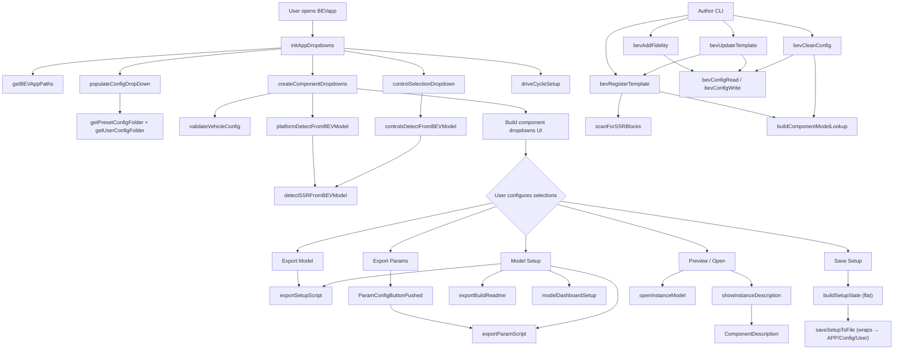

# APP API Functions

Supporting functions for `BEVapp.mlapp`, organized into responsibility-based subfolders.

## Folder Overview

| Folder | Role | Files |
|--------|------|-------|
| `Author/` | Template authoring — register templates, add fidelities, sync configs, cleanup | 7 |
| `Catalog/` | What's valid — config validation, template resolution, component entries | 3 |
| `Detect/` | What exists — model scanning, subsystem reference detection, platform/controls detection | 6 |
| `State/` | What's selected — flat setup state build, save/load, session cache | 4 |
| `Export/` | Artifact generation — setup scripts, param scripts, param link validation, build snapshot | 5 |
| `UI/` | Presentation — dropdowns, descriptions, panels, preview, selection apply | 23 |
| `Util/` | Generic helpers — project root, path resolution, file listing, param namespace | 10 |

## Author

| Function | Purpose |
|----------|---------|
| `bevRegisterTemplate` | Scan a vehicle template `.slx` and write its component structure to a config file |
| `bevAddFidelity` | Add or modify a fidelity entry for a component in a config file |
| `bevUpdateTemplate` | Rescan a template and sync all config files that reference it |
| `bevCleanConfig` | Remove stale fidelities from a config file by checking models on disk |
| `bevConfigRead` | Read a JSON config file and return a MATLAB struct |
| `bevConfigWrite` | Write a MATLAB struct to a JSON config file |
| `buildComponentModelLookup` | Build a component-to-model lookup table from `Components/` folders |

## Catalog

| Function | Purpose |
|----------|---------|
| `buildComponentEntries` | Build component entry structs from config JSON for a given platform |
| `resolveTemplateName` | Resolve template display name to config key |
| `validateVehicleConfig` | Validate JSON config structure for one or all platforms |

## Detect

| Function | Purpose |
|----------|---------|
| `checkTemplateSubsystemRefs` | Verify that all subsystem reference blocks in a template model point to valid SLX files |
| `controlsDetectFromBEVModel` | Detect controller subsystem references in the base model |
| `detectSSRFromBEVModel` | Scan BEV model for Subsystem Reference blocks matching a candidate list |
| `platformDetectFromBEVModel` | Detect vehicle platform subsystem references in the base model |
| `scanComponentAvailability` | Scan component folders and report which SLX fidelities exist on disk |
| `scanForSSRBlocks` | Scan a loaded model for Subsystem Reference blocks (fast then fallback) |

## State

| Function | Purpose |
|----------|---------|
| `buildSetupState` | Capture current app UI state into a flat struct (TemplateName as field, not wrapper key) |
| `restoreFromCache` | Restore UI selections from session cache on config switch |
| `saveSetupToFile` | Save current setup to `APP/Config/User` as wrapped JSON (superset of raw config) |
| `snapshotToCache` | Snapshot current selections to session cache before switching config |

## Export

| Function | Purpose |
|----------|---------|
| `ensureParamLinks` | Validate all component param file links; show fix-up dialog for missing links |
| `ParamConfigButtonPushed` | Thin orchestrator — validate links via `ensureParamLinks`, then export via `exportParamScript` |
| `exportBuildReadme` | Write a README.md build snapshot into the timestamped output folder |
| `exportParamScript` | Generate a `.m` script that calls linked component parameter files |
| `exportSetupScript` | Generate a replayable `.m` script that sets all Subsystem References |

## UI

| Function | Purpose |
|----------|---------|
| `applySelections` | Apply saved selections from a setup JSON to current dropdowns |
| `applySetupState` | Apply a full setupState struct back to the app UI |
| `ComponentDescription` | Generate preview snapshot and load component description text |
| `computeParamMissingNote` | Build warning text for components with missing param file links |
| `controlSelectionDropdown` | Populate controller dropdown and detect current controller |
| `createComponentDropdowns` | Build component instance dropdowns from config JSON and template |
| `initAppDropdowns` | Populate all top-level dropdowns at app startup (replaces inline mlapp code) |
| `descTextHTML` | Convert plain text description to styled HTML |
| `driveCycleSetup` | Populate drive cycle dropdown from Drive Cycle Source block mask |
| `loadAppShortcut` | Launch BEVapp with a loading splash screen |
| `modelDashboardSetup` | Configure model HMI blocks (AWD, Regen, Charging) from toggles |
| `modelDescription` | Generate preview snapshot and load BEV model description text |
| `openInstanceModel` | Open the selected component SLX in Simulink |
| `openParamSmart` | Open a component's parameter file in the editor |
| `paramContextLink` | Link a param file to a component instance |
| `populateConfigDropDown` | Scan Preset + User config folders and populate ConfigDropDown with full-path ItemsData |
| `paramContextUnlink` | Unlink a param file from a component instance |
| `preventMissingSelection` | Guard against missing dropdown selections before export |
| `renderComponentPanels` | Build the scrollable component panel layout |
| `scaleAppToMonitor` | Auto-scale app UI to monitor DPI and resolution |
| `selectionPreviewStatus` | Toggle visibility of the preview image panel |
| `showInstanceDescription` | Display description and preview for a selected component |
| `updateParamTooltip` | Update tooltip text on param file link buttons |

## Util

| Function | Purpose |
|----------|---------|
| `buildList` | Build nested HTML lists from struct/cell data |
| `discoverParamNamespace` | Parse param `.m` files to extract namespace and field names |
| `ensureSlxList` | Append `.slx` extension to basenames that lack it |
| `getBEVAppPaths` | Centralized folder path resolution — returns struct with all app-relevant paths |
| `getBEVProjectRoot` | Return the MATLAB project root folder |
| `getPresetConfigFolder` | Return absolute path to `APP/Config/Preset` |
| `getSLXFiles` | List `.slx` files in a folder |
| `getUserConfigFolder` | Return absolute path to `APP/Config/User` (auto-creates on first call) |
| `getUserSetupScriptFolder` | Return absolute path to `Script_Data/Setup/User` (auto-creates on first call) |
| `userDataSetField` | Safely set a field on UIFigure.UserData struct |

## Code Flow

Copyright 2026 The MathWorks, Inc.
