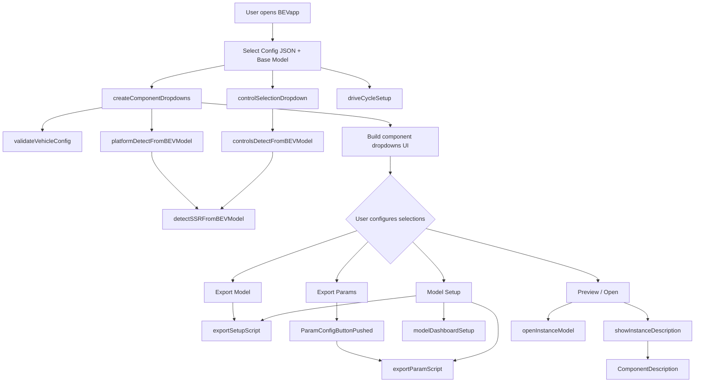

# APP API Functions

Supporting functions for `BEVapp.mlapp`. Organized by role below.

## Function Inventory

### UI Setup

| Function | Purpose |
|----------|---------|
| `createComponentDropdowns` | Build component instance dropdowns from config JSON and vehicle template |
| `controlSelectionDropdown` | Populate controller dropdown and detect current controller from model |
| `driveCycleSetup` | Populate drive cycle dropdown from the Drive Cycle Source block mask |
| `scaleAppToMonitor` | Auto-scale app UI to monitor DPI and resolution |

### Detection

| Function | Purpose |
|----------|---------|
| `detectSSRFromBEVModel` | Scan BEV model for Subsystem Reference blocks matching a candidate list |
| `platformDetectFromBEVModel` | Detect vehicle platform SSR in the base model (wrapper around `detectSSRFromBEVModel`) |
| `controlsDetectFromBEVModel` | Detect controller SSR in the base model (wrapper around `detectSSRFromBEVModel`) |

### Export

| Function | Purpose |
|----------|---------|
| `exportSetupScript` | Generate a replayable `.m` script that sets all Subsystem References |
| `exportParamScript` | Generate a `.m` script that calls linked component parameter files and sets environment/HVAC values |
| `ParamConfigButtonPushed` | Check param file links before export; show modal dialog for missing links |
| `modelDashboardSetup` | Configure model HMI blocks (AWD, Regen, Charging) from app toggle buttons |

### Preview and Description

| Function | Purpose |
|----------|---------|
| `showInstanceDescription` | Display description and preview image for a selected component |
| `ComponentDescription` | Generate preview snapshot and load model description text |
| `selectionPreviewStatus` | Toggle visibility of the preview image panel |
| `openInstanceModel` | Open the selected component SLX in Simulink |
| `descTextHTML` | Convert plain text description to HTML |
| `buildList` | Build nested HTML lists from struct/cell data |

### Validation

| Function | Purpose |
|----------|---------|
| `validateVehicleConfig` | Validate JSON config structure for one or all platforms |

### Utilities

| Function | Purpose |
|----------|---------|
| `getBEVProjectRoot` | Return the MATLAB project root folder |
| `getSLXFiles` | List `.slx` files in a folder |
| `getJSONFiles` | List `.json` files in a folder |
| `ensureSlxList` | Append `.slx` extension to basenames that lack it |
| `extractRefModelBase` | Extract model basename from a ReferencedSubsystem path |
| `loadAppShortcut` | Launch BEVapp with a loading splash screen |

## Code Flow

Copyright 2026 The MathWorks, Inc.
