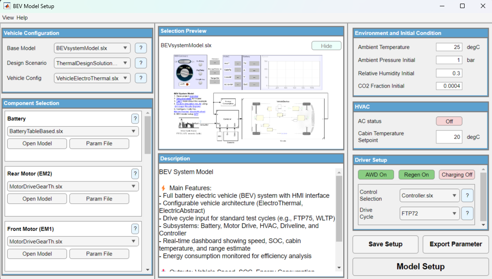

# BEV Setup App

Configure and export a battery electric vehicle Simulink model through a single GUI. Select a vehicle template, pick component fidelities, set environment and HVAC conditions, choose a drive cycle, and export a ready-to-simulate model with parameter scripts.



## Folder Structure

```
APP/
  BEVapp.mlapp        -- App Designer GUI
  API/                -- 49 supporting functions
    Catalog/   (3)    -- Config validation, template resolution
    Detect/    (5)    -- Model scanning, platform/controls detection
    State/     (4)    -- Setup state build, save, cache
    Export/    (4)    -- Script generation, param export, link validation
    UI/       (23)    -- Dropdowns, descriptions, panels, preview
    Util/     (10)    -- Project root, path helpers, file listing
  Config/             -- JSON configuration files
    Preset/           -- Shipped template configs (read-only)
    User/             -- User-saved setup configs (gitignored)
  Documents/          -- Help pages and screenshots
    html/             -- HTML help files
    images/           -- UI screenshots
```

## Contents

| Item | Description |
|------|-------------|
| `BEVapp.mlapp` | Main App Designer application |
| `API/` | Back-end functions organized by responsibility (see `API/README.md`) |
| `Config/` | JSON configuration files — `Preset/` for shipped configs, `User/` for saved setups |
| `Documents/` | Help pages (`html/helpAppDetail.html`) and UI screenshots (`images/`) |

Copyright 2022 - 2026 The MathWorks, Inc.
