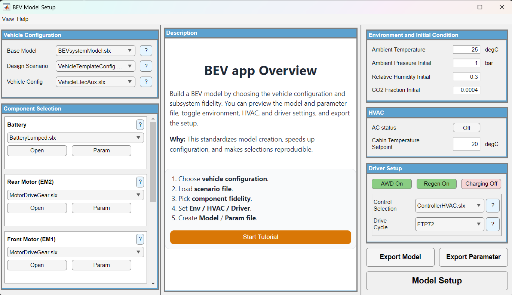

# BEV Setup App

Configure and export a battery electric vehicle Simulink model through a single GUI. Select a vehicle template, pick component fidelities, set environment and HVAC conditions, choose a drive cycle, and export a ready-to-simulate model with parameter scripts.



## Folder Structure

```
APP/
  BEVapp.mlapp        -- App Designer GUI
  API/                -- 24 supporting functions
  Document/           -- Screenshots and HTML help
```

## Contents

| Item | Description |
|------|-------------|
| `BEVapp.mlapp` | Main App Designer application |
| `API/` | All back-end functions called by the app |
| `Document/` | Help pages (`helpAppDetail.html`) and UI screenshots used in documentation |

Copyright 2022 - 2025 The MathWorks, Inc.
