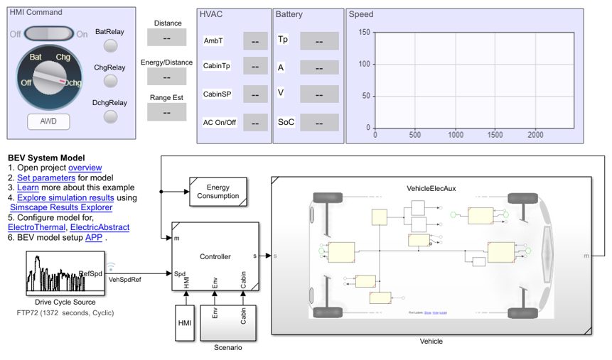
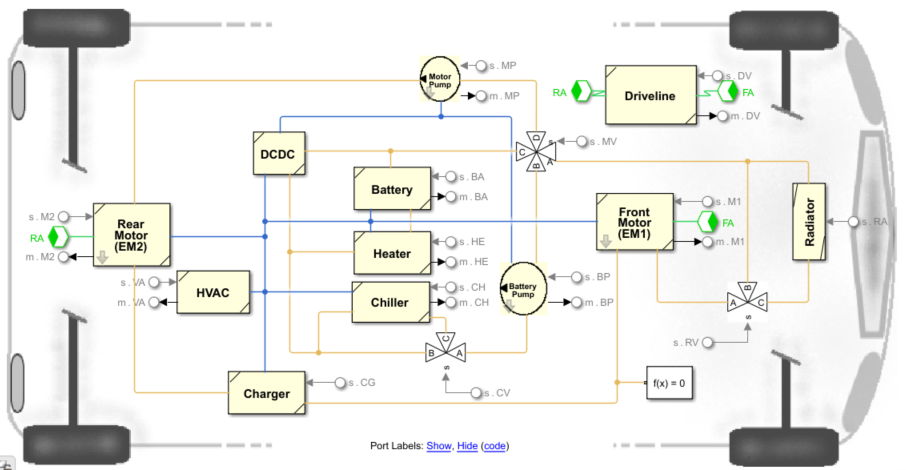
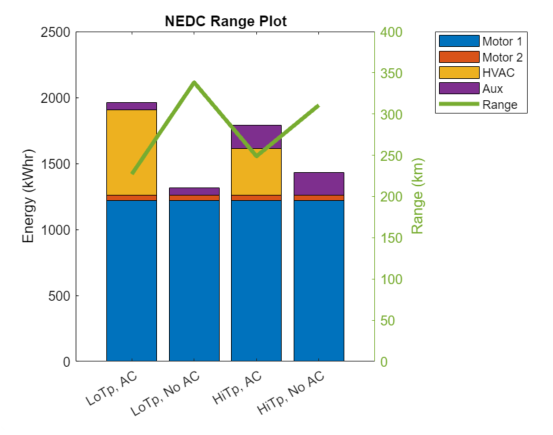
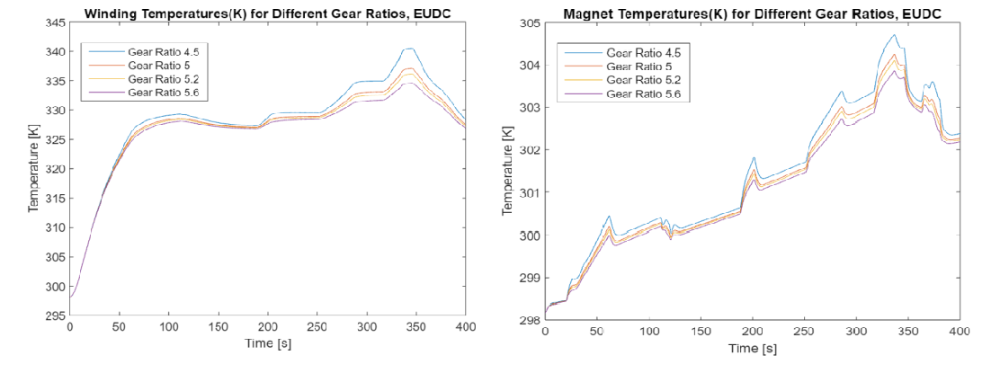
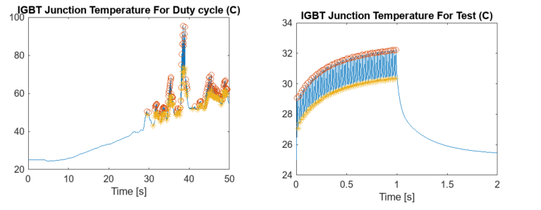
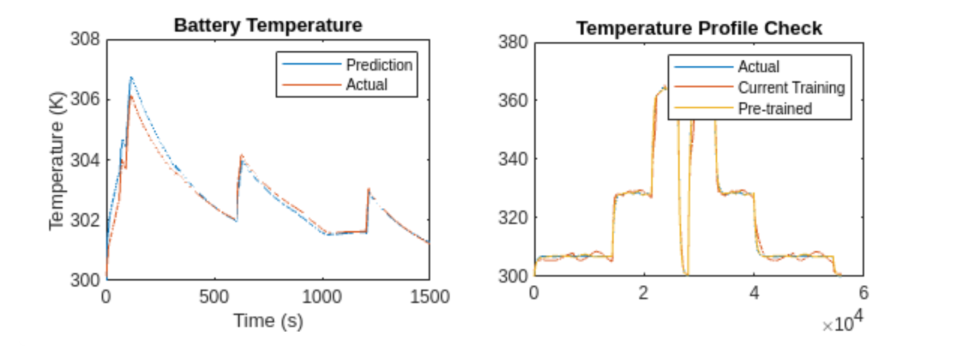

# Electric Vehicle Design with Simscape

To reduce greenhouse gas emissions, meet climate goals, and arrest 
global warming, the automotive sector is rapidly developing and proposing 
innovative low-carbon solutions. Among these solutions, electric vehicles (EVs) 
have gained traction thanks to their reduced carbon footprint and 
overall efficiency. The mass adoption of EVs depends on factors including 
the cost of ownership, safety, and range anxiety. Typically, these vehicles 
employ large battery packs, which are often the most expensive component of
the vehicle. Modeling and simulation play then an important role in reducing 
the development cost and enabling greater adoption of these vehicles.

The examples in this repository show you how to model an automotive 
battery electric vehicle (BEV) for range estimation and battery sizing. The 
battery pack comprises several battery modules as combinations of cells in 
series and parallel. The vehicle model is a coupled electrical, mechanical, 
and thermal model built using Simscape&trade; Battery&trade;, Simscape Driveline&trade;, 
Simscape Electrical&trade;, and Simscape Fluids&trade; Libraries.

There are workflows in this project where you learn how to:
1. Simulate an all wheel drive (AWD) and a front wheel drive (FWD) vehicle.
   

2. Estimate the on-road range of the vehicle. Run drive cycles 
with different ambient conditions to determine the range of the vehicle with 
a given capacity.

3. Size your high-voltage (HV) battery pack to achieve your desired range.
You learn how to simulate battery packs with different capacities and 
weights, and compare them based on how these factors affect the range of the vehicle.

4. Setup your electric motor test bench for system integration.

5. Find the fixed gear ratio suitable for BEV application.
   

6. Generate a loss map for the motor and inverter.

7. Estimate the inverter power module semiconductor device junction temperature 
variation due to switching and predict the lifetime of the inverter.

8. Build a neural network model to predict battery temperature.
    

## Setup 
* Clone the project repository.
* Open ElectricVehicleSimscape.prj to get started with the project. 
* Requires MATLAB&reg; release R2022b or newer.

Copyright 2022 - 2023 The MathWorks, Inc.
