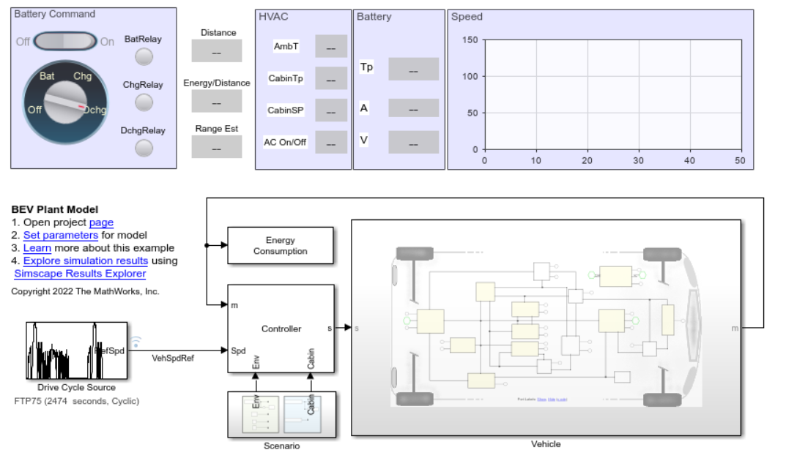
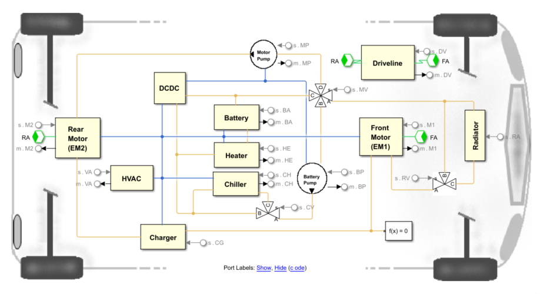

# Electric Vehicle Design with Simscape

To reduce the greenhouse gas emissions, meet climate goals, and arrest 
global warming, the automotive sector is rapidly developing and proposing 
innovative low-carbon solutions. Among these solutions, electric vehicles (EV) 
have strongly gained traction thanks to their reduced carbon footprint and 
overall efficiency. The mass adoption of these EVs depends on multiple 
factors including the cost of ownership, safety, and range anxiety. 
Typically, these vehicles employ large battery packs, which often represent 
the most expensive component of the vehicle. Modeling and simulation play 
then an important role in reducing the development cost and enabling an even 
greater adoption of these vehicles.

The examples in this repository show you how to model an automotive 
battery electric vehicle (BEV) for range estimation and battery sizing. The 
battery pack comprises several battery modules as combinations of cells in 
series and parallel. The vehicle model is a coupled electrical and thermal 
model built using Simscape&trade Battery&trade;, Simscape Driveline&trade;, 
Simscape Electrical&trade;, and Simscape Fluids&trade; Libraries.

In these examples, you learn how to:
* Simulate an all wheel drive (AWD) or a forward wheel drive (FWD) vehicle.
* Estimate the on-road range of the vehicle.
* Size your high-voltage (HV) battery pack to achieve your desired range.
* Setup your electric motor test bench for system integration.

## Setup 
* Clone the project repository.
* Open ElectricVehicleSimscape.prj to get started with the project. 
* Requires MATLAB&reg; release R2022b or newer.

Copyright 2022 - 2023 The MathWorks, Inc.
