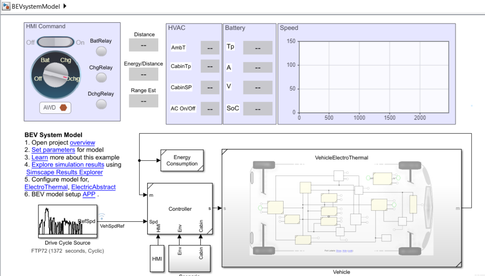
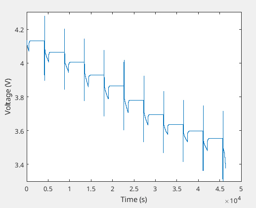
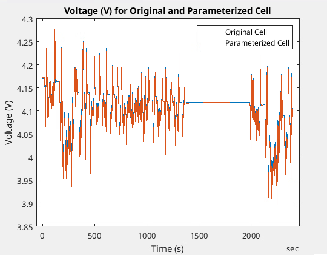
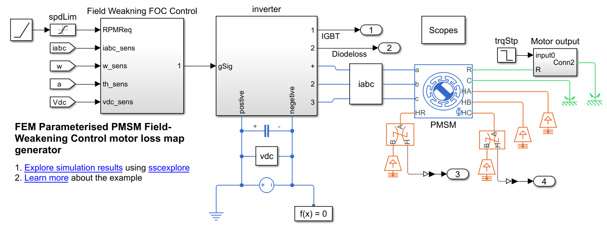

# Electric Vehicle Design with Simscape

<table>
  <tr>
    <td class="text-column" width=300> 
The key components of an electrified platform include HV battery pack, an 
e-drive system, HVAC, and other electromechanical components. Design of an 
electric drivetrain is often a collaborative effort between diverse groups 
and model sharing and reuse becomes important. In this project, a battery 
electric vehicle is modelled with components available in different fidelity, 
for you to select and run based on application need. The vehicle model is a 
coupled electrical, mechanical, and thermal model built using Simscape&trade;, 
Battery&trade;, Simscape Driveline&trade;, Simscape Electrical&trade;, and 
Simscape Fluids&trade; Libraries. </td>
    <td class="image-column" width=600></td>
  </tr>
</table>

In this project, you will learn about the following **seven engineering 
workflows**:

## 1. Estimate Driving Range of Electric Vehicle
<table>
  <tr>
    <td class="image-column" width=600></td>
    <td class="text-column" width=300>Estimate the on-road range of the vehicle. Run drive cycles with different ambient conditions to determine the range of the vehicle with a given capacity. See <strong>Workflow/RangeEstimation</strong>.</td>
  </tr>
</table>

<table>
  <tr>
    <td class="text-column" width=1200></td>
  </tr>
</table>

## 2. Size Battery for Electric Vehicle
<table>
  <tr>
    <td class="image-column" width=300></td>
    <td class="text-column" width=600>Size your high-voltage (HV) battery pack to achieve your desired range. You will learn how to simulate battery packs with different capacities and weights, and compare them based on how these factors affect the range of the vehicle. See <strong>Workflow/BatterySizing</strong>.</td>
  </tr>
</table>

<table>
  <tr>
    <td class="text-column" width=1200></td>
  </tr>
</table>

## 3. Characterize Battery using HPPC Test Data
<table>
  <tr>
    <td class="image-column" width=300></td>
    <td class="image-column" width=300></td>
    <td class="text-column" width=300>Find parameters for an equivalent circuit based battery model from HPPC test data. See <strong>Workflow/CellCharacterization</strong>.</td>
  </tr>
</table>

<table>
  <tr>
    <td class="text-column" width=1200></td>
  </tr>
</table>

## 4. Create Battery Virtual Sensors (Neural Networks)
<table>
  <tr>
    <td class="image-column" width=600></td>
    <td class="text-column" width=300>Build a neural network model to predict battery temperature. This Neural network model takes in battery voltage and current measurements to predict battery temperature. This, when deployed, can help in eliminating some thermal sensors in the battery pack and reduce cost of development. See <strong>Workflow/BatteryNeuralNetModel</strong>.</td>
  </tr>
</table>

<table>
  <tr>
    <td class="text-column" width=1200></td>
  </tr>
</table>

## 5. Estimate Efficient Gear Ratio for Electric Drive
<table>
  <tr>
    <td class="image-column" width=600></td>
    <td class="text-column" width=300>Drive units with fixed gear ratio are usually the most cost effective option for battery electric vehicle. To determine an appropriate fixed gear ratio, run a design of experiment (DoE) which covers a range of gear ratios and test cycle parameters. See <strong>Workflow/GearRatioSelect</strong>.</td>
  </tr>
</table>

<table>
  <tr>
    <td class="text-column" width=1200></td>
  </tr>
</table>

## 6. Setup Electric Motor Test Bench for System Integration
<table>
  <tr>
    <td class="text-column" width=300>Learn how to generate a permanent magnet synchronous motor (PMSM) for a system level (electro-thermal) simulation by creating a motor loss map and integrating it into the system level blocks. See <strong>Workflow/GenerateMotInvLoss</strong>.</td>
    <td class="image-column" width=600></td>
  </tr>
</table>

<table>
  <tr>
    <td class="text-column" width=1200></td>
  </tr>
</table>

## 7. Verify Electric Drive Durability and Life
<table>
  <tr>
    <td class="image-column" width=600></td>
    <td class="text-column" width=300>Estimate the inverter power module semiconductor device junction temperature variation due to switching and predict the lifetime of the inverter. See <strong>Workflow/InverterLife</strong> and <strong>Workflow/ThermalDurability</strong>.</td>
  </tr>
</table>

<table>
  <tr>
    <td class="text-column" width=1200></td>
  </tr>
</table>

## Setup 
* Clone the project repository.
* Open ElectricVehicleSimscape.prj to get started with the project. 
* Requires MATLAB&reg; release R2024b or newer.

Copyright 2022 - 2025 The MathWorks, Inc.
