# Electric Vehicle Design with Simscape

<table>
  <tr>
    <td class="text-column" width=300> 
The key components of an electrified platform include HV battery pack, an 
e-drive system, HVAC, and other electromechanical components. Design of an 
electric drivetrain is often a collaborative effort between diverse groups 
and model sharing and reuse becomes important. In this project, a battery 
electric vehicle is modelled with components available in different fidelity, 
for you to select and run based on application need. The vehicle model is a 
coupled electrical, mechanical, and thermal model built using Simscape&trade;, 
Battery&trade;, Simscape Driveline&trade;, Simscape Electrical&trade;, and 
Simscape Fluids&trade; Libraries. </td>
    <td class="image-column" width=600>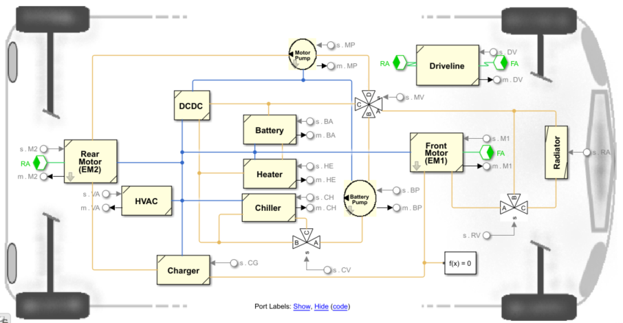</td>
  </tr>
</table>

## Getting Started

  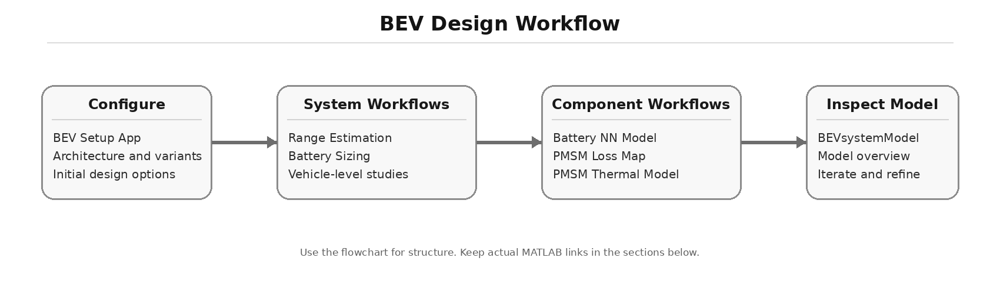

The project includes preset vehicle configurations that define the model
architecture — component fidelities, thermal subsystems, and control strategy.
Choose an entry point that fits your workflow, then proceed to the
engineering studies below.

<table>
  <tr>
    <td class="text-column" width=400>
      <strong>Open the base model</strong> — Load <code>BEVsystemModel.slx</code>
      directly to explore the reference vehicle architecture.  
      <strong>Start from a preset</strong> — Pick a shipped vehicle configuration
      from <code>APP/Config/Preset</code> to begin with a ready-made component
      and fidelity selection.  
      <strong>Use the BEV Setup App</strong> — Select a template, choose component
      variants, and configure initial design parameters for your specific
      use case.
    </td>
    <td class="image-column" width=500></td>
  </tr>
</table>

## Engineering Workflows

In this project, you will learn about the following **seven engineering 
workflows**:

## 1. Estimate Driving Range of Electric Vehicle
<table>
  <tr>
    <td class="image-column" width=600>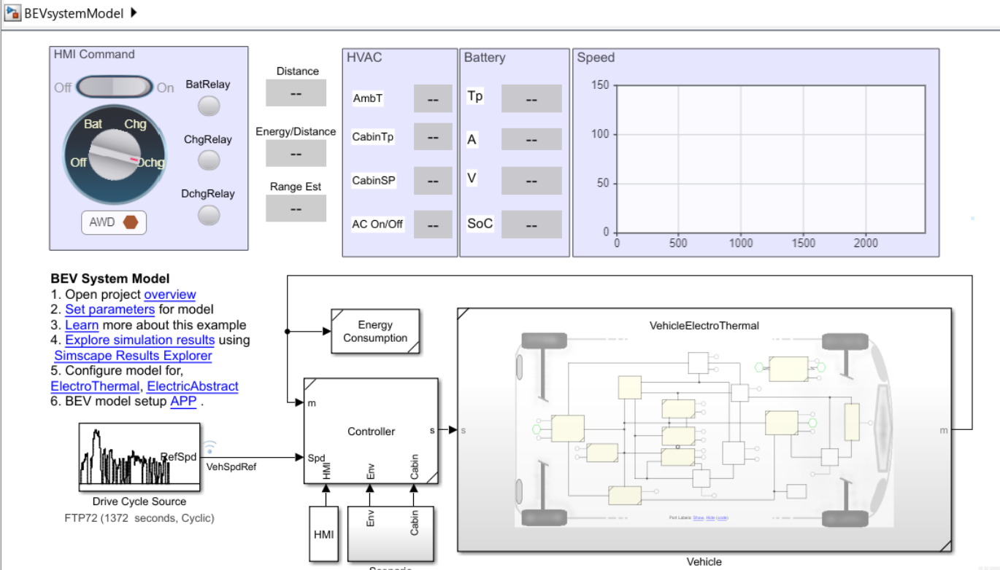</td>
    <td class="text-column" width=300>Estimate the on-road range of the vehicle. Run drive cycles with different ambient conditions to determine the range of the vehicle with a given capacity. See <strong>Workflow/Vehicle/RangeEstimation</strong>.</td>
  </tr>
</table>

## 2. Size Battery for Electric Vehicle
<table>
  <tr>
    <td class="image-column" width=300>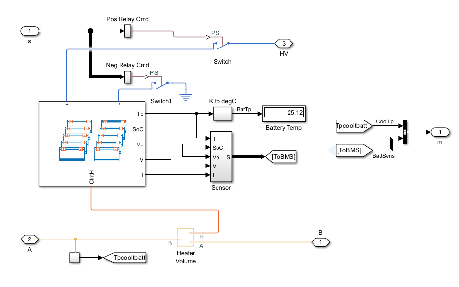</td>
    <td class="text-column" width=600>Size your high-voltage (HV) battery pack to achieve your desired range. You will learn how to simulate battery packs with different capacities and weights, and compare them based on how these factors affect the range of the vehicle. See <strong>Workflow/Battery/BatterySizing</strong>.</td>
  </tr>
</table>

## 3. Characterize Battery using HPPC Test Data
<table>
  <tr>
    <td class="image-column" width=300>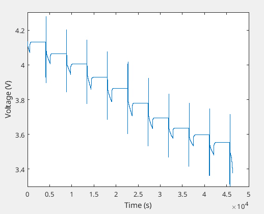</td>
    <td class="image-column" width=300>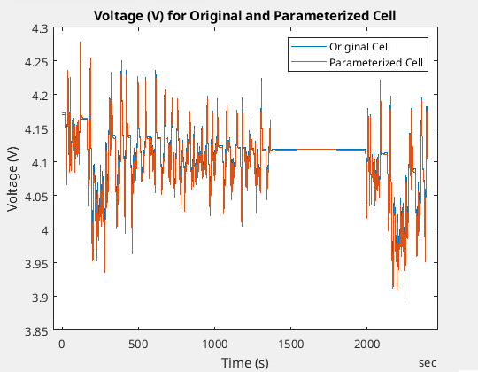</td>
    <td class="text-column" width=300>Find parameters for an equivalent circuit based battery model from HPPC test data. See <strong>Workflow/Battery/CellCharacterization</strong>.</td>
  </tr>
</table>

## 4. Create Battery Virtual Sensors (Neural Networks)
<table>
  <tr>
    <td class="image-column" width=600>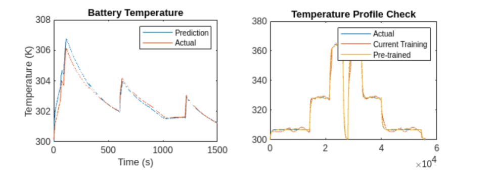</td>
    <td class="text-column" width=300>Build a neural network model to predict battery temperature. This Neural network model takes in battery voltage and current measurements to predict battery temperature. This, when deployed, can help in eliminating some thermal sensors in the battery pack and reduce cost of development. See <strong>Workflow/Battery/VirtualSensorNeuralNetModel</strong>.</td>
  </tr>
</table>

## 5. Estimate Efficient Gear Ratio for Electric Drive
<table>
  <tr>
    <td class="image-column" width=600>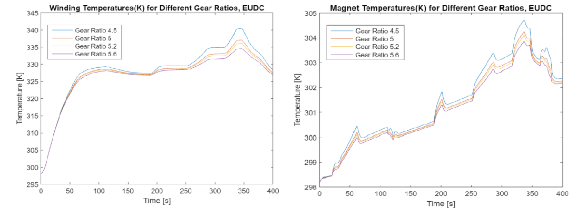</td>
    <td class="text-column" width=300>Drive units with fixed gear ratio are usually the most cost effective option for battery electric vehicle. To determine an appropriate fixed gear ratio, run a design of experiment (DoE) which covers a range of gear ratios and test cycle parameters. See <strong>Workflow/MotorDrive/GearRatioSelect</strong>.</td>
  </tr>
</table>

## 6. Setup Electric Motor Test Bench for System Integration
<table>
  <tr>
    <td class="text-column" width=300>Learn how to generate a permanent magnet synchronous motor (PMSM) for a system level (electro-thermal) simulation by creating a motor loss map and integrating it into the system level blocks. See <strong>Workflow/MotorDrive/GenerateMotInvLoss</strong>.</td>
    <td class="image-column" width=600>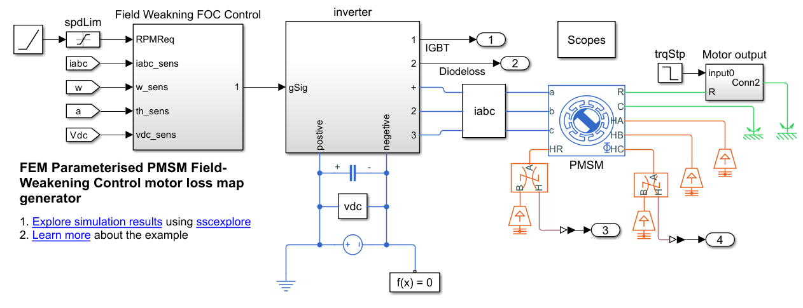</td>
  </tr>
</table>

## 7. Verify Electric Drive Durability and Life
<table>
  <tr>
    <td class="image-column" width=600>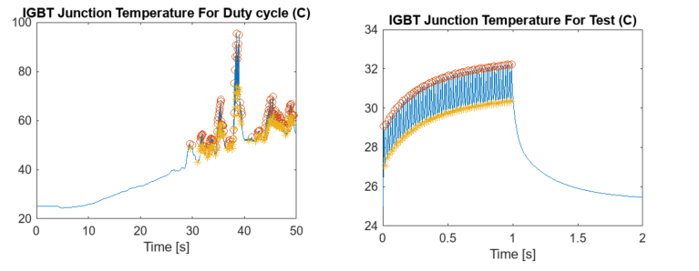</td>
    <td class="text-column" width=300>Estimate the inverter power module semiconductor device junction temperature variation due to switching and predict the lifetime of the inverter. See <strong>Workflow/MotorDrive/InverterLife</strong> and <strong>Workflow/MotorDrive/ThermalDurability</strong>.</td>
  </tr>
</table>

## Repository Architecture

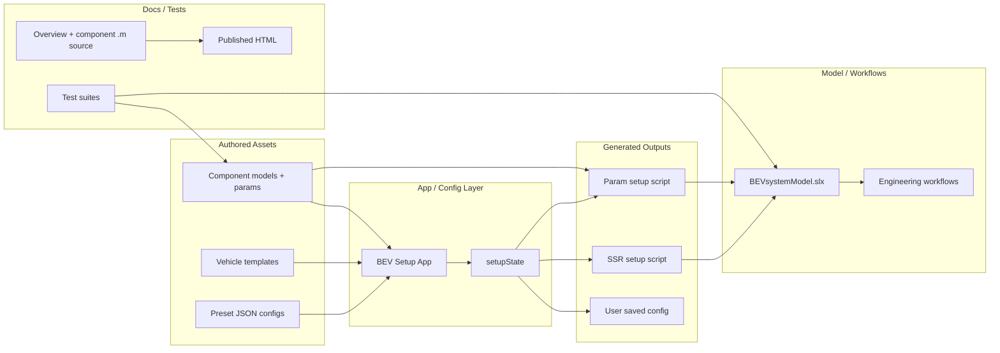
```mermaid
flowchart LR
    subgraph Authored["Authored Assets"]
        direction TB
        JSON["Preset JSON configs"]
        VT["Vehicle templates"]
        COMP["Component models + params"]
    end

    subgraph App["App / Config Layer"]
        direction TB
        BEVApp["BEV Setup App"]
        SS["setupState"]
    end

    subgraph Gen["Generated Outputs"]
        direction TB
        SSR["SSR setup script"]
        PAR["Param setup script"]
        UJSON["User saved config"]
    end

    subgraph Runtime["Model / Workflows"]
        direction TB
        SYS["BEVsystemModel.slx"]
        WF["Engineering workflows"]
    end

    subgraph DocsTests["Docs / Tests"]
        direction TB
        SRC["Overview + component .m source"]
        HTML["Published HTML"]
        TST["Test suites"]
    end

    JSON --> BEVApp
    VT --> BEVApp
    COMP --> BEVApp
    BEVApp --> SS
    SS --> SSR
    SS --> PAR
    SS --> UJSON
    COMP --> PAR
    SSR --> SYS
    PAR --> SYS
    SYS --> WF
    SRC --> HTML
    TST --> SYS
    TST --> COMP
```

| Folder | Responsibility |
|--------|---------------|
| `APP/` | BEV Setup App — GUI, API back-end, preset and user configs |
| `Components/` | 12 self-contained component packages (models, params, tests, docs) |
| `Model/` | System-level Simulink model and 4 vehicle templates |
| `Script_Data/` | System params, legacy setup scripts, generated export output |
| `Workflow/` | Engineering workflows — Battery, MotorDrive, Vehicle |
| `Overview/` | Published MATLAB overview pages (source `.m` → `html/`) |
| `Test/` | Project-level test suite — system model, workflow, project checks |

| Concern | Source of Truth |
|---------|----------------|
| Template → component → fidelity mapping | `APP/Config/Preset/*.json` |
| Component fidelity availability | `Components/*/Model/*.slx` on disk |
| Parameter values | `Components/*/Model/*Params.m` |
| System model wiring | `BEVsystemModel.slx` subsystem references |
| Documentation | `Overview/*.m` and `Components/*/Documentation/*.m` (source, not HTML) |

For the full architecture reference — folder contracts, config schema, app layers, export flow, drift risks, and extension guides — see **[Overview/README.md](Overview/README.md)**.

## Setup 
* Clone the project repository.
* Open ElectricVehicleSimscape.prj to get started with the project. 
* Requires MATLAB&reg; release R2024b or newer.

Copyright 2022 - 2026 The MathWorks, Inc.
