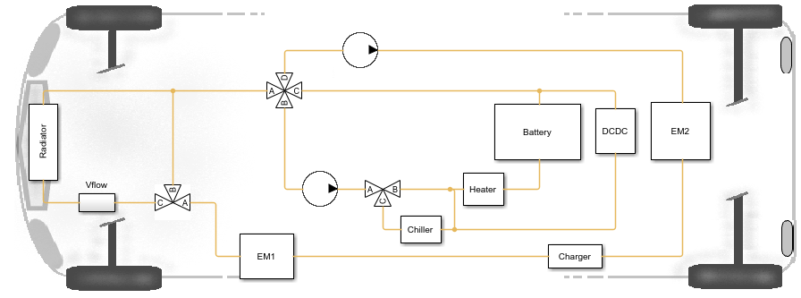

# Electric Vehicle Design with Simscape

---

## 📖 Table of Contents  

- Overview  
- Engineering Solutions (_scroll-down for details_)
  - Range Estimation for Electric Vehicle,
  - Size Battery for Electric Vehicle,
  - Analyze Thermal Durability for PMSM,
  - Motor Inverter Loss Map Generation,
  - Estimate Inverter Power Module End of Life,
  - Select Gear Ratio for Electric Vehicle, and
  - Build Virtual Sensor for BMS.
- Utilities
- Prerequisites
- Setup

---

## 🌍 Overview  

Most modern EV are powered by Li-ion based battery chemistry and electric 
drivetrains with permanent magnet synchronous motors (PMSM) and/or induction 
motors. Modeling and simulation helps you design vehicles that meet the 
desired range on the road and perform under all environmental conditions. 
This project contains Simscape&trade; based workflows and utilities that 
help you create different vehicle platforms and analyze their components 
as well as the overall system.

---

## ⚡ Engineering Solutions  

### Range Estimation for Electric Vehicle
<table>
  <tr>
    <td class="image-column" width=400></td>
    <td class="text-column" width=200> </td>
    <td class="text-column" width=300>Estimate the on-road range of the vehicle. Run drive cycles with different ambient conditions to determine the range of the vehicle with a given capacity. See <strong><a href="Workflow/Vehicle/RangeEstimation/README.md">Workflow/Vehicle/RangeEstimation</a></strong>.</td>
  </tr>
</table>

### Size Battery for Electric Vehicle
<table>
  <tr>
    <td class="text-column" width=600>Size your high-voltage (HV) battery pack to achieve your desired range. You will learn how to simulate battery packs with different capacities and weights, and compare them based on how these factors affect the range of the vehicle. See <strong><a href="Workflow/Battery/BatterySizing/README.md">Workflow/Battery/BatterySizing</a></strong>.</td>
    <td class="image-column" width=300></td>
  </tr>
</table>

### Analyze Thermal Durability for PMSM
<table>
  <tr>
    <td class="image-column" width=600></td>
    <td class="text-column" width=300>Run the thermal test bench over extended duty cycles at multiple coolant sump temperatures to assess winding and magnet thermal margins See <strong><a href="Workflow/MotorDrive/ThermalDurability/README.md">Workflow/MotorDrive/ThermalDurability</a></strong>.</td>
  </tr>
</table>

### Motor Inverter Loss Map Generation
<table>
  <tr>
    <td class="text-column" width=300>Generate copper, iron, IGBT, and diode loss maps by sweeping the FOC-controlled PMSM across speed, torque, and temperature points. See <strong><a href="Workflow/MotorDrive/GenerateMotInvLoss/README.md">Workflow/MotorDrive/GenerateMotInvLoss</a></strong>.</td>
    <td class="image-column" width=600></td>
  </tr>
</table>

### Estimate Inverter Power Module End of Life
<table>
  <tr>
    <td class="image-column" width=600></td>
    <td class="text-column" width=300>Capture IGBT and diode junction temperatures from drive-cycle simulations, apply rainflow cycle counting, and estimate semiconductor lifetime. See <strong><a href="Workflow/MotorDrive/GenerateMotInvLoss/README.md">Workflow/MotorDrive/GenerateMotInvLoss</a></strong>.</td>
  </tr>
</table>

### Select Gear Ratio for Electric Vehicle
<table>
  <tr>
    <td class="text-column" width=300>Sweep candidate gear ratios over EUDC and US06 cycles on the thermal test bench and compare magnet and winding temperatures to find the best ratio. See <strong><a href="Workflow/MotorDrive/GearRatioSelect/README.md">Workflow/MotorDrive/GearRatioSelect</a></strong>.</td>
    <td class="image-column" width=600></td>
  </tr>
</table>

### Build Virtual Sensor for BMS
<table>
  <tr>
    <td class="image-column" width=600></td>
    <td class="text-column" width=300>Train a neural network to predict battery cell temperature from current, voltage, and SOC inputs. A pre-trained model is included for verification. See <strong><a href="Workflow/Battery/VirtualSensorNeuralNetModel/README.md">Workflow/Battery/VirtualSensorNeuralNetModel</a></strong>.</td>
  </tr>
</table>

---

## 🛠️ Utilities 
<table>
  <tr>
    <td class="image-column" width=400></td>
    <td class="text-column" width=100></td>
    <td class="text-column" width=400>You can also launch the <a href="APP/README.md">BEV Setup App</a> (<code>BEVapp</code>) to select
      a template, choose component fidelities, link parameter files, and configure environment, HVAC, and driver settings for your vehicle model.</td>
  </tr>
</table>

---

## 🛠️ Prerequisites  

---

## 🚀 Setup  

Download the repository and run the ElectricVehicleSimscape PRJ file (in project root) to set up the MATLAB project and all relevant file path.
